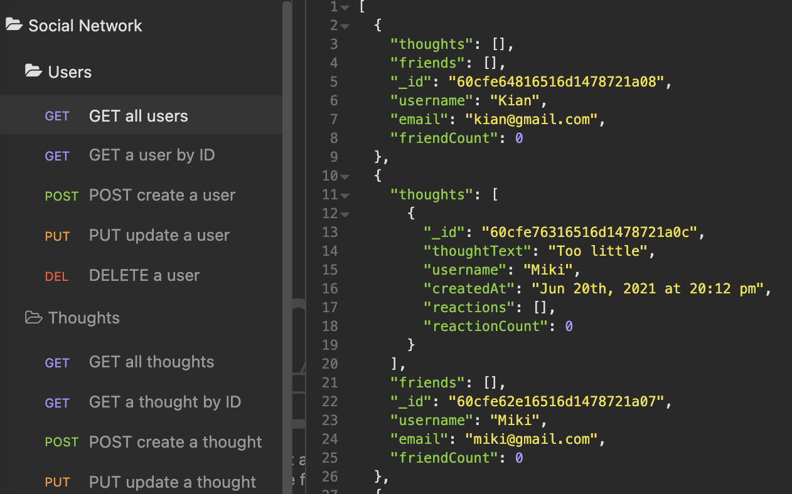

# Social Network API

### Description 
This is a back-end API project that allows people to share thoughts and interaction with each other. The demonstration is tested on Insomnia. 

### Installation
* `npm install` to install all dependencies

### Usage
1. `npm start` to start the server 

### Screenshot of Insomnia requests

### Usage and Demo

### Technology
* Node.js
* Express.js
* Mongoose
* MongoDB
